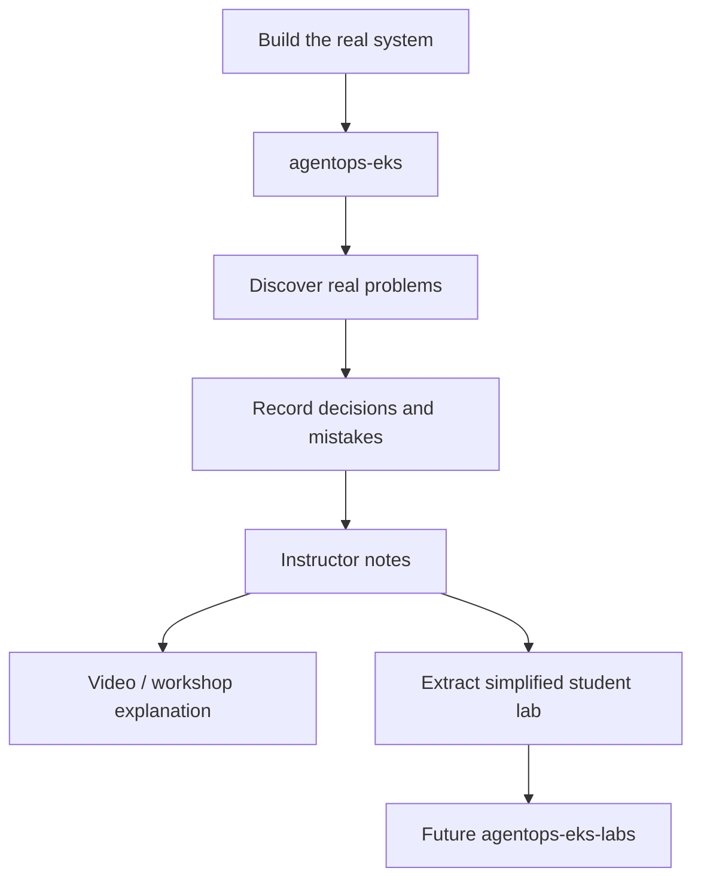
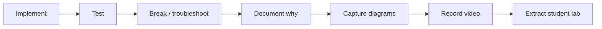

# Instructor Notes

This folder captures **how to explain the project**, not just how to implement it.

The engineering implementation remains the source of truth in the milestone documents and code. Instructor notes are a second layer that records the teaching narrative, diagrams, analogies, common mistakes, checkpoints, and ideas that can later be extracted into a separate student repository.

## Why keep instructor material separate?

`agentops-eks` has two jobs:

1. Prove the engineering work is real and portfolio-grade.
2. Preserve the knowledge required to explain that work clearly.

The future student repository should have a different job: help a learner build the architecture progressively without exposing every implementation detail at once.

## Instructor repo vs student repo

| Instructor/reference repo | Future student repo |
|---|---|
| Complete implementation | Starter implementation |
| Engineering tradeoffs | Guided decisions |
| Real troubleshooting history | Curated common mistakes |
| Full milestone Definition of Done | Lab checkpoints |
| Portfolio evidence | Learning exercises |
| ADRs and design reasoning | Explanations and challenges |
| Production-style reference | Safe progressive path |

Do not create the student repo until the corresponding instructor milestone has been completed at least once. The best teaching material should come from problems actually encountered while building the system.

## Teaching extraction workflow

For every milestone:

Capture the following while implementing:

- What was confusing before it worked?
- What failed and why?
- Which AWS/Kubernetes concept had to be understood rather than copied?
- Which design choice was deliberately simplified for a lab?
- Which command or observation proved the component was healthy?
- What should a learner understand before seeing the code?
- Which detail is useful for an engineer but unnecessary for a beginner?
- What screenshot, terminal output, or diagram would make the explanation obvious?

## Video teaching rule

Prefer this sequence:

1. **Problem** — why the component exists.
2. **Mental model** — explain it visually before showing code.
3. **Architecture** — where the component fits.
4. **Implementation** — show only the important files/commands.
5. **Verification** — prove it works.
6. **Failure mode** — show one realistic mistake when useful.
7. **Tradeoff** — explain what would change in production.
8. **Next capability** — connect to the following milestone.

The code should support the explanation; the video should not become a narrated file-by-file walkthrough.

## Current teaching guide

- [v0.1 Foundation teaching guide](v0.1-teaching-guide.md)

Future guides should be added only when their milestone becomes active enough that there is real experience worth teaching.
