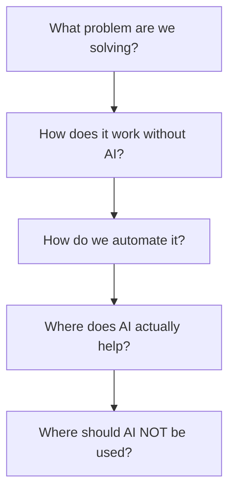
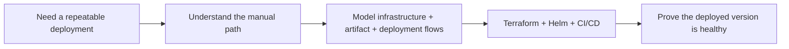
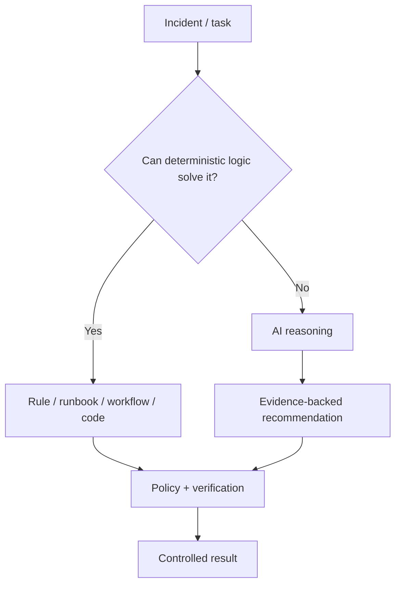
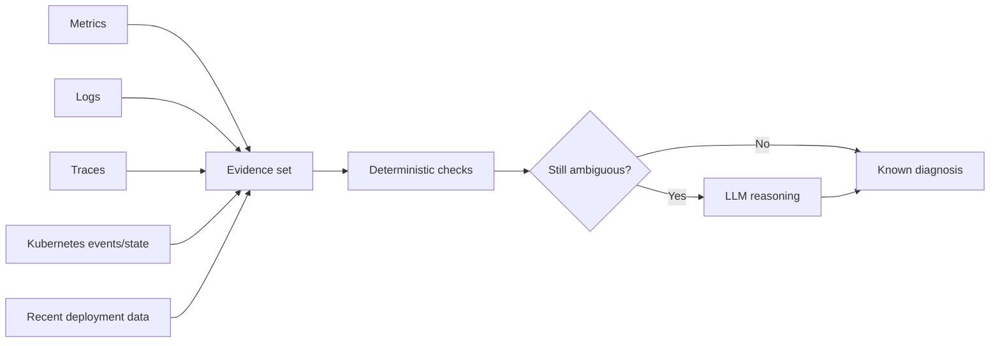
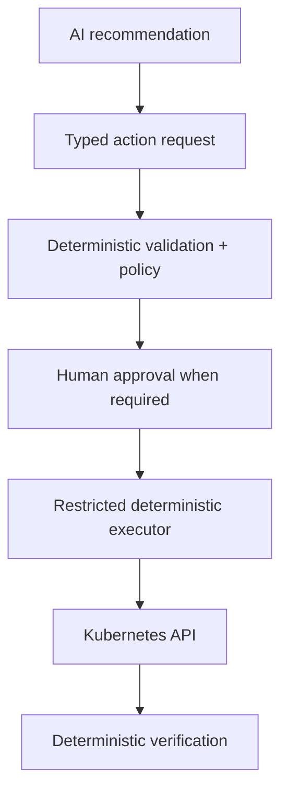
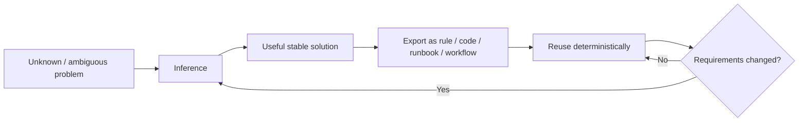
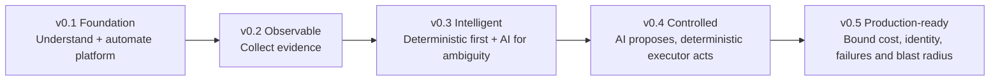
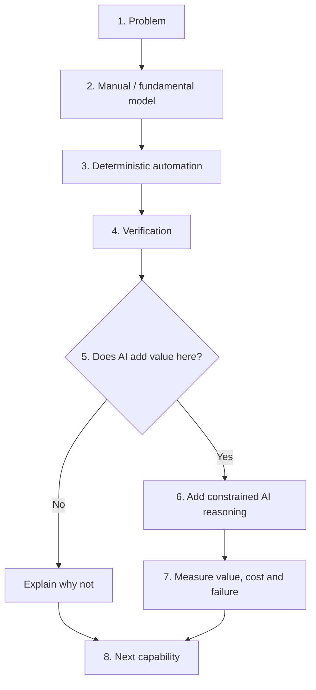

# AI Platform from First Principles

This document defines the durable teaching and architecture philosophy for `agentops-eks`.

The project should not teach people to copy infrastructure files or outsource understanding to an LLM. It should teach them how to reason about a platform, automate it deliberately, and introduce AI only where inference adds value.

## Core teaching sequence



This sequence is the default lens for every milestone, video, workshop, architecture decision, and future student lab.

---

## Why this matters

A platform engineer should be able to understand, operate, troubleshoot, and maintain a system even when an AI assistant is unavailable.

The goal is not to avoid AI. The goal is to avoid using inference as a substitute for understanding or as an expensive replacement for deterministic software.

The long-lived skill is not knowing one AI framework. It is being able to answer:

- What is the system doing?
- Why does this component exist?
- What are its inputs and outputs?
- What can fail?
- What should be deterministic?
- Where is uncertainty high enough that reasoning is useful?
- How do we verify the result?
- How will we maintain this on day 300?

Frameworks will change. These questions should not.

---

## Principle 1 — Understand before automating

Do not begin with:

```text
Copy this Terraform.
Copy this YAML.
Ask Claude.
Done.
```

Begin with the system model.

Example for v0.1:



Automation should encode a process we understand, not hide one we do not.

---

## Principle 2 — Deterministic first, inference when necessary

Before sending a problem to an LLM, ask whether normal software can solve it reliably.



Examples that may not need inference:

- checking whether a pod is `OOMKilled`,
- comparing restart counts with a threshold,
- verifying whether a Deployment rollout completed,
- checking whether `/healthz` returns success,
- enforcing replica minimum/maximum values,
- rejecting an action outside an allowlist.

Examples where inference may add value:

- correlating several weak signals across logs, metrics, traces and recent deployments,
- ranking multiple plausible root causes,
- explaining evidence in a form useful to an operator,
- proposing a next diagnostic step when the failure does not match a known runbook.

The project should make this boundary visible and measurable.

---

## Principle 3 — Evidence before inference

The AI agent should reason over observable evidence instead of guessing from a vague prompt.



This is why v0.2 observability comes before v0.3 AI reasoning.

---

## Principle 4 — AI proposes; deterministic systems execute

An LLM should not become a shell with cluster-admin privileges.

For write operations, keep reasoning and execution separated:



The executor should implement a small set of known operations such as:

```text
restart_deployment(name)
scale_deployment(name, replicas)
```

not arbitrary shell commands generated by the model.

---

## Principle 5 — Infer once when possible, then export the stable loop

A useful pattern from the Zero Token Architecture discussion is to notice when inference discovers something that can become normal software.



Examples:

- an AI-generated diagnostic sequence becomes a tested runbook,
- a repeated remediation becomes an allowlisted executor function,
- a frequently inferred policy becomes deterministic validation,
- a repeated query/analysis becomes code or a cached computation.

AI is useful during discovery. Stable repeated behavior should graduate toward cheaper, predictable execution where practical.

---

## Principle 6 — Measure the cost of intelligence

By the time AI is introduced, the project should be able to compare deterministic and inference paths.

Useful measurements include:

```text
incidents_total
deterministic_diagnoses_total
ai_investigations_total
ai_escalation_rate
tokens_per_investigation
estimated_cost_per_investigation
latency_per_path
successful_diagnosis_rate
low_confidence_rate
tool_calls_per_investigation
```

The question is not only:

> Did the agent solve the problem?

Also ask:

> Did this problem need an agent at all?

---

## Principle 7 — Optimize for maintenance, not the demo

Every architecture decision should survive the question:

> Would we be happy maintaining this system after hundreds of days?

Prefer:

- explicit contracts,
- observable flows,
- small permission surfaces,
- replaceable model providers,
- deterministic verification,
- reproducible infrastructure,
- documented tradeoffs,
- bounded failure modes.

Avoid complexity whose main purpose is making the demo look more "agentic."

---

## How the principles map to milestones



### v0.1 — Foundation

Learn how the platform works before adding intelligence.

### v0.2 — Observable

Make the system legible to humans first. AI cannot reason reliably about evidence that does not exist.

### v0.3 — Intelligent

Run deterministic checks before invoking the LLM. Use inference for ambiguous diagnosis and explanation.

### v0.4 — Controlled

Convert recommendations into typed, validated, allowlisted operations. Keep privileged execution outside the model.

### v0.5 — Production-ready

Measure inference usage and cost. Bound reasoning loops, tool calls and failures. Identify repeated AI paths that should become deterministic software.

---

## Instructor pattern for every lesson

Use this teaching flow:



For the student, "where AI should not be used" is part of the lesson, not an omission.

---

## Video positioning

A durable channel/project positioning is:

> **AI Platform from First Principles**

The content should differentiate itself from copy/paste tutorials by repeatedly explaining:

1. the underlying computing problem,
2. the non-AI system that solves it,
3. the automation layer,
4. the boundary where inference becomes useful,
5. the boundary where inference becomes wasteful or dangerous.

Potential recurring questions for videos:

- Can I explain this without mentioning an AI framework?
- What would happen if the model/API disappeared?
- Which part can become deterministic code?
- What evidence does the model actually receive?
- How much does the inference path cost compared with the deterministic path?
- What does the operator control when the AI is wrong?

---

## Context: Zero Token Architecture

Kelsey Hightower's PlatformCon 2026 talk **"ZTA: Zero Token Architecture"** is useful inspiration for this philosophy. The durable lesson we adopt is not that every system should literally use zero tokens. It is that engineers should understand the system first, avoid inference for work that deterministic software already solves well, and turn stable repeated AI-generated behavior into reusable automation when practical.

Reference talk:

https://www.youtube.com/watch?v=A7WFt2JQ5sg

`agentops-eks` treats this as an engineering lens, not as a formal architecture standard or a dependency on a specific AI trend.
