# v0.1 Foundation — Instructor Teaching Guide

## Teaching objective

Explain how a small application moves from source code to a reproducible Amazon EKS deployment using Terraform, ECR, Helm, and GitHub Actions.

The learner should finish the explanation understanding **why each platform component exists and how the pieces connect**, not merely knowing which commands to copy.

v0.1 deliberately contains no AI agent. The teaching point is that reliable AgentOps starts with reliable platform engineering.

---

## 1. Opening story for the video

Suggested framing:

> Before putting an AI agent in Kubernetes, we need somewhere reliable to run it. In this first milestone we build that foundation: networking, EKS, a small application, an immutable container release, Helm deployment, and CI/CD without permanent AWS keys.

The question the video answers is:

> **How do we create a reproducible delivery path from a Git commit to a healthy workload running on EKS?**

Do not begin the video with Terraform syntax. Begin with the delivery problem.

---

## 2. The complete mental model

Use this diagram early in the explanation.

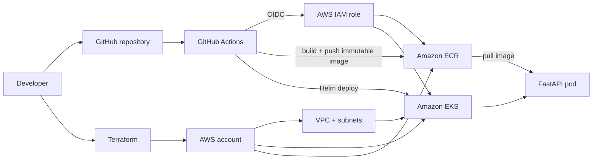

### Instructor explanation

There are really three flows:

1. **Infrastructure flow** — Terraform creates the environment.
2. **Artifact flow** — source code becomes a container image stored in ECR.
3. **Deployment flow** — GitHub Actions tells Kubernetes which immutable image to run through Helm.

Keep returning to these three flows whenever the student gets lost.

---

## 3. Why Terraform comes first

### Concept to teach

We do not want a cluster that exists because someone clicked through AWS Console screens and can no longer remember what they selected.

Terraform makes the desired infrastructure explicit and repeatable.

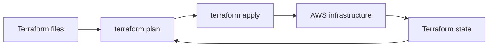

### Explain state before backend syntax

Terraform needs memory of what it manages. The state answers questions such as:

- Which VPC belongs to this configuration?
- Which EKS cluster already exists?
- Which resources need to change?

For collaborative/reproducible work, the final v0.1 stores that state remotely rather than relying on one laptop.

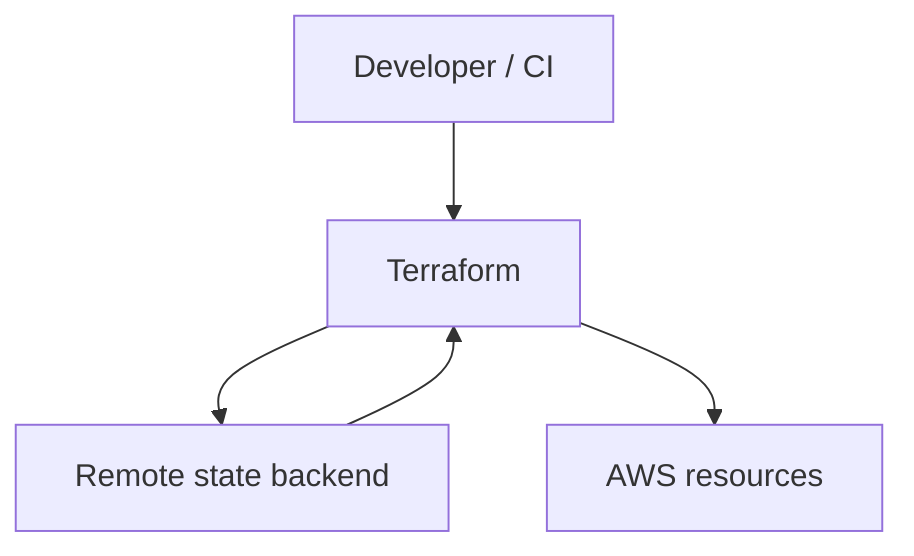

### Useful analogy

Terraform configuration is the **architectural plan**; Terraform state is the **inventory of what was actually built**.

### Common misconception

> “Terraform state is just a cache that can always be deleted.”

Correct this immediately. It is operationally important data and should be protected accordingly.

### Student checkpoint

The learner should be able to explain, without code:

> Why is remote state useful, and what problem would occur if every engineer had an unrelated local state file?

---

## 4. VPC and subnet mental model

Do not teach every AWS networking detail in v0.1. Teach only what is required to understand where EKS workloads live.

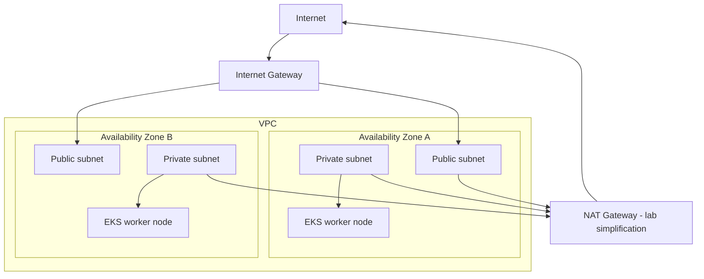

### Key teaching points

- A **VPC** is the network boundary for these AWS resources.
- We use more than one Availability Zone to avoid designing around one failure domain.
- Worker nodes can live in private subnets and still make outbound connections through NAT.
- v0.1 may intentionally use one NAT gateway to reduce lab cost; that is a cost/availability tradeoff, not the ideal HA production pattern.
- Cluster administration should not depend on inbound SSH to nodes.

### Question for the learner

> If the EKS nodes are in private subnets, how can they still pull a container image from ECR?

The answer should lead naturally into routing/NAT and later into ECR.

---

## 5. EKS mental model: control plane vs workloads

This diagram is important because many learners incorrectly think “EKS” is one machine.

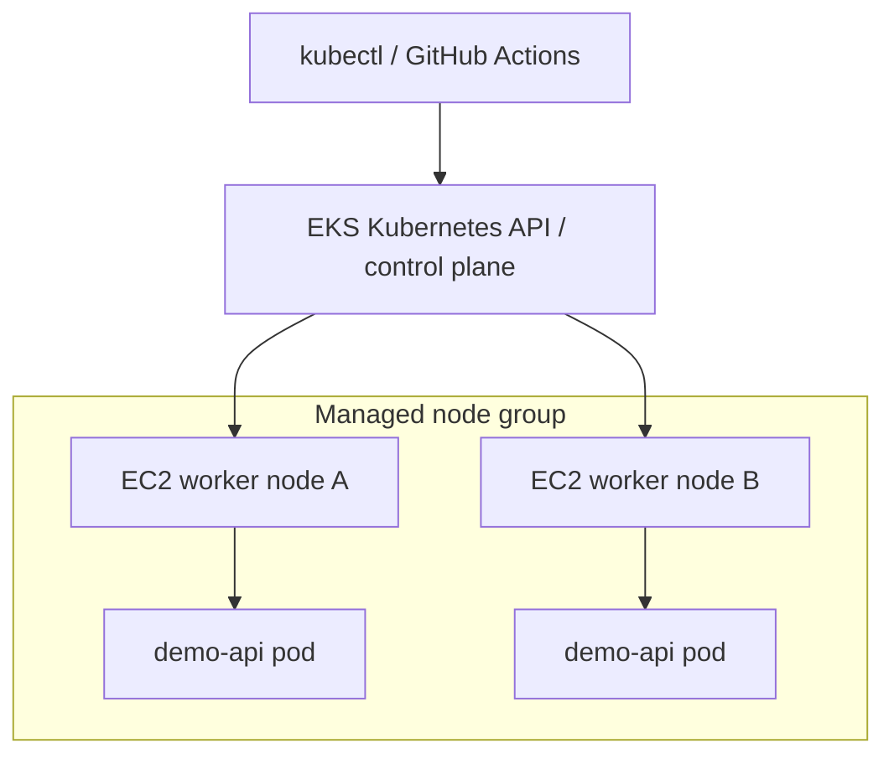

### Explain clearly

- AWS manages the EKS control-plane service.
- The Kubernetes API stores/describes desired cluster state.
- Managed node groups provide compute where pods actually run.
- `kubectl` talks to the Kubernetes API, not normally to individual worker nodes.
- A healthy control plane is not enough; worker nodes must join and report `Ready`.

### Verification is part of the lesson

Show:

```bash
kubectl get nodes
kubectl get pods -A
```

Explain what “Ready” proves and what it does **not** prove.

### Common mistakes worth capturing while implementing

Record real examples if encountered:

- Node does not join cluster.
- IAM/access entry prevents `kubectl` access.
- Routing prevents node egress.
- An add-on/system pod remains unhealthy.

These are future teaching material; do not manufacture errors merely to fill the guide.

---

## 6. Why ECR exists

The learner needs a clean artifact model:

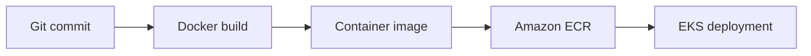

### Teach immutability

Do not make `latest` the release identity.

Use the Git commit SHA:

```text
source commit: 3f94e21
container: demo-api:3f94e21
running version: 3f94e21
```

This gives a simple chain of evidence:

```mermaid
flowchart LR
    COMMIT[Git SHA] --> IMAGE[Image tag]
    IMAGE --> DEPLOY[Helm release]
    DEPLOY --> VERSION[/version endpoint]
```

### Key question

> If production is broken, can we identify exactly which source commit created the running image?

v0.1 should make the answer yes.

---

## 7. Why the demo application is intentionally boring

Do not spend valuable video time building application features.

The FastAPI service exists to teach the platform.

Required behavior:

```text
/healthz    process alive
/readyz     ready for traffic
/version    deployment identity
/api/status simple business behavior
```

### Explain the difference between health and readiness

Use this mental model:

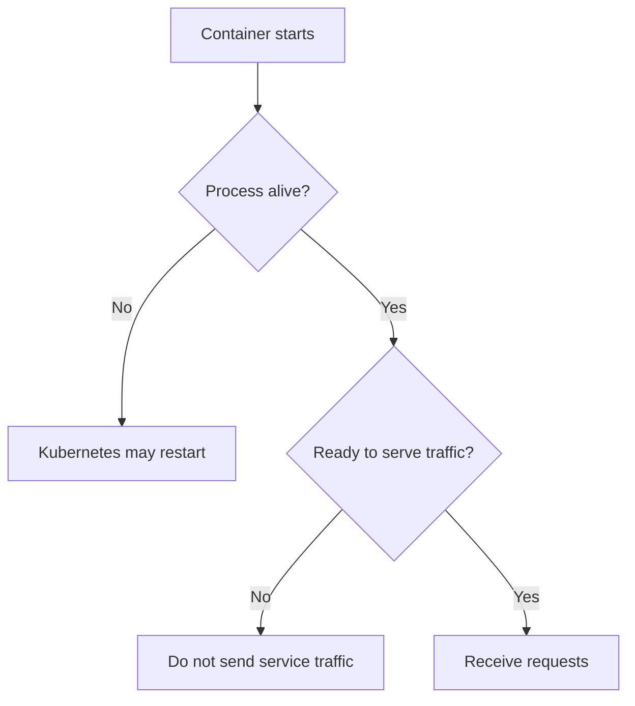

The conceptual distinction is more valuable than memorizing YAML probe syntax.

---

## 8. Why Helm is introduced

Without Helm, we could apply raw YAML. The teaching goal is to show why parameterized deployments are useful when the image changes every release.

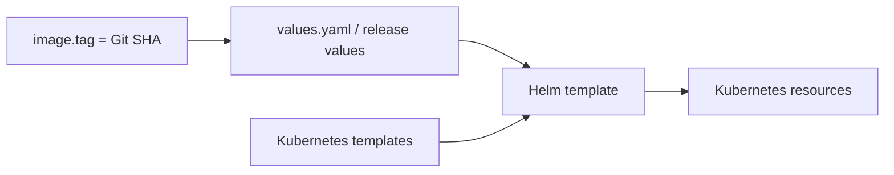

### What v0.1 should teach about a deployment

- Deployment vs pod.
- ClusterIP Service.
- Readiness/liveness probes.
- Resource requests and limits.
- Rolling updates.
- Image repository/tag supplied as values.

### What not to teach yet

Avoid expanding scope into:

- Service mesh.
- Full ingress architecture.
- Autoscaling.
- OpenTelemetry.
- AI agent frameworks.

Those features belong to later requirements or only when they solve a demonstrated problem.

---

## 9. GitHub Actions: from manual proof to repeatable delivery

Explain that we intentionally perform one manual build/push/deploy while constructing the milestone to verify each link. Then we automate the same known-good path.

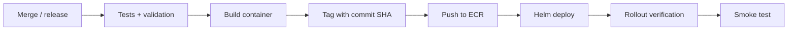

### CI and CD are different teaching ideas

**CI asks:** Is this change safe enough to consider releasable?

```text
Python tests
Terraform format/validate
Helm lint
Container build
```

**CD asks:** Can the validated change be delivered and verified automatically?

```text
AWS auth
ECR push
EKS access
Helm deployment
rollout
smoke test
```

Do not collapse both concepts into “the pipeline.”

---

## 10. GitHub OIDC → AWS: explain the security improvement visually

### The pattern we do not want

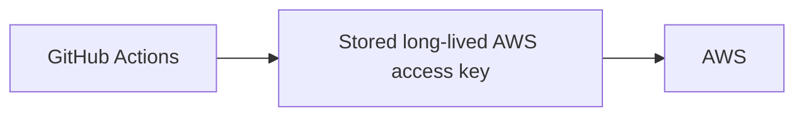

Problem: the secret remains useful outside the immediate workflow until rotated/revoked.

### Preferred v0.1 pattern

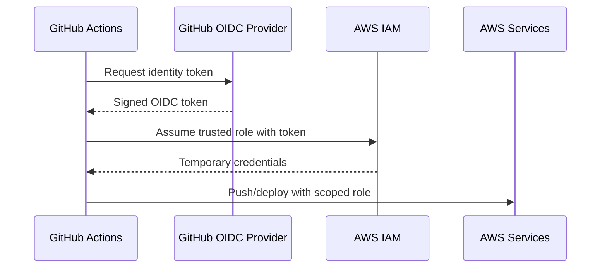

### Teaching points

- GitHub proves the workflow identity using OIDC.
- AWS trust policy decides which repository/branch/environment may assume the role.
- AWS returns temporary credentials.
- The role should have only the deployment permissions it needs.

### Student question

> Why is OIDC better than committing or storing a permanent AWS access key for the pipeline?

---

## 11. The final end-to-end story

By the end of the video, the learner should be able to narrate this diagram without help:

```mermaid
flowchart LR
    A[Developer pushes code] --> B[GitHub]
    B --> C[CI validates]
    C --> D[GitHub OIDC authenticates to AWS]
    D --> E[Container built]
    E --> F[ECR image tagged with commit SHA]
    F --> G[Helm deploys to EKS]
    G --> H[Kubernetes rollout succeeds]
    H --> I[Smoke test]
    I --> J[/version confirms expected SHA]
```

That is the central story of v0.1.

---

## 12. Suggested video structure

A useful first pass could be:

### Section A — Why build the foundation?

Explain where v0.1 sits in the AgentOps roadmap and why adding AI first would hide platform problems.

### Section B — Architecture before code

Show the complete architecture diagram and identify the three flows: infrastructure, artifact, deployment.

### Section C — Terraform + networking + EKS

Explain the infrastructure mental model. Show only enough code to connect the concepts to implementation.

### Section D — Application + container + Helm

Use the tiny FastAPI app to explain probes, resource controls, immutable images, and Kubernetes deployments.

### Section E — GitHub Actions + OIDC

Show how manual delivery becomes CI/CD and why temporary AWS credentials matter.

### Section F — Verification

Show the evidence:

```text
terraform validation
kubectl nodes Ready
pods healthy
workflow green
/version = deployed Git SHA
```

### Section G — What would fail in production?

Discuss the intentional lab compromises, especially networking cost/HA, without pretending v0.1 is a complete production platform.

### Section H — Bridge to v0.2

End with the problem:

> The application is running, but can we explain why it is slow or failing?

That naturally motivates **v0.2 Observability**.

---

## 13. Instructor capture checklist during implementation

Do not wait until recording day. During v0.1, capture:

- [ ] Screenshot/terminal output of first successful `terraform plan`.
- [ ] First successful EKS node `Ready` output.
- [ ] Any real EKS/network/IAM failure and its root cause.
- [ ] ECR image showing immutable commit tag.
- [ ] Local FastAPI health/version output.
- [ ] Helm deployment/rollout output.
- [ ] Failed CI example if one naturally occurs.
- [ ] Successful GitHub Actions workflow.
- [ ] OIDC/IAM trust relationship explanation.
- [ ] `/version` matching the deployed Git SHA.
- [ ] Teardown/recreate observations.
- [ ] Actual AWS cost drivers observed during the lab.
- [ ] One sentence explaining each major tradeoff.

These artifacts can later become video B-roll, screenshots, diagrams, student troubleshooting notes, and consulting evidence.

---

## 14. Questions the instructor should be able to answer before publishing

1. Why EKS rather than running the demo directly on one EC2 instance?
2. Why private worker subnets?
3. Why does Terraform need state?
4. Why use more than one Availability Zone?
5. Why is one NAT gateway a lab compromise?
6. Why ECR?
7. Why tag images with a commit SHA?
8. What is the difference between a pod and a Deployment?
9. What is the difference between liveness and readiness?
10. Why specify resource requests and limits from the first release?
11. Why Helm instead of editing manifests manually each deployment?
12. What is CI checking versus what CD is doing?
13. Why use GitHub OIDC instead of long-lived AWS keys?
14. What proves a deployment actually succeeded?
15. Why verify `/version` after deployment?
16. What parts of this architecture are intentionally not production-complete yet?
17. What problem will v0.2 solve that v0.1 cannot?

If one of these is difficult to answer clearly, capture the gap before recording rather than hiding it behind commands.

---

## 15. Future student-lab extraction

After `v0.1.0` is complete, build the student version from the evidence collected here.

Suggested student progression:

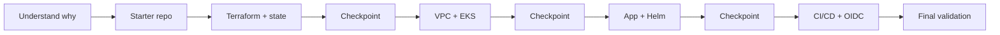

The student repo should not merely copy this instructor document. It should simplify the path into exercises, checkpoints, optional challenges, and troubleshooting hints based on what actually happened during the instructor implementation.

---

## 16. One-sentence lesson

> **v0.1 teaches how to build a reproducible, traceable path from infrastructure code and a Git commit to a verified workload running on Amazon EKS.**

Everything shown in the video should reinforce that sentence.
