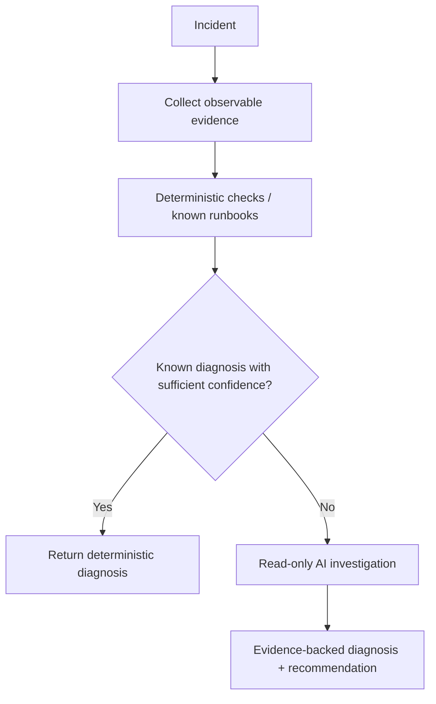

# v0.3 Intelligent — Deterministic-first, Read-only Incident Agent

## Goal
Add a deterministic-first incident investigation path that uses AI only when known checks and runbooks do not sufficiently explain the evidence. The AI investigator can collect evidence and recommend actions but cannot modify the cluster.

## Entry requirements
- v0.2 observability Definition of Done satisfied.
- At least one reproducible incident with useful metrics/logs/traces.
- A human can explain the reference incident from telemetry before AI is introduced.

## First-principles decision flow



The objective is not to maximize agent usage. The objective is to use the cheapest, most predictable mechanism that can solve the incident correctly.

## Required capabilities
- Deterministic pre-check layer for known conditions such as restart reason, rollout state, health checks or explicit thresholds where appropriate.
- Explicit escalation decision from deterministic checks to AI reasoning.
- Separate `incident-agent` workload and service account.
- Kubernetes RBAC limited to the minimum read operations required.
- Read-only tools for selected pods, deployments, events, logs and metrics.
- LLM provider abstraction.
- Structured output containing probable cause, evidence, confidence and recommended next step.
- Tool-call logging/tracing.
- Maximum tool/reasoning iterations, timeout and failure handling.
- Prompt/tool inputs treated as untrusted data.
- Explicit protection against accidental write operations.
- Metrics that distinguish deterministic and AI paths.

## Minimum path metrics

Track enough data to answer whether inference was actually necessary:

```text
incidents_total
deterministic_diagnoses_total
ai_investigations_total
ai_escalation_rate
tokens_per_investigation
latency_per_path
low_confidence_rate
tool_calls_per_investigation
```

## Security requirement
The agent service account must not have Kubernetes write verbs for operational resources. Tests must prove writes are rejected.

## Required scenarios
At least two reproducible incidents, for example:
- OOMKilled/restart pattern.
- Broken release / CrashLoopBackOff.
- Latency/error spike.

At least one scenario should be intentionally solvable through deterministic checks so the system demonstrates that the LLM can be bypassed. At least one should contain enough ambiguity to justify AI reasoning.

For each scenario, compare the resulting diagnosis with known ground truth.

## Definition of Done
- [ ] Deterministic checks execute before AI escalation where applicable.
- [ ] At least one known scenario is diagnosed without an LLM call.
- [ ] At least one ambiguous scenario escalates to the read-only agent.
- [ ] Agent gathers evidence through allowlisted read-only tools.
- [ ] Kubernetes write attempt from the agent identity fails.
- [ ] Diagnosis response uses a documented structured schema.
- [ ] Evidence cited by the agent can be inspected independently.
- [ ] Tool calls and model execution are traceable.
- [ ] Time/iteration bounds prevent uncontrolled reasoning loops.
- [ ] Deterministic vs AI path usage/latency/token metrics are observable.
- [ ] Failure/low-confidence behavior is documented.

## Out of scope
- Direct remediation.
- Executor write permissions.
- Automatic approvals.
- Using the LLM for checks that are deliberately implemented as deterministic rules.

## Portfolio evidence
Demo the contrast:

```text
known incident → deterministic diagnosis → zero inference
ambiguous incident → evidence collection → AI reasoning → recommendation
```

Then prove that the same AI identity cannot modify the workload.

The portfolio story is not "I put an LLM in Kubernetes." It is "I designed an incident system that knows when AI is useful and when normal software is better."
