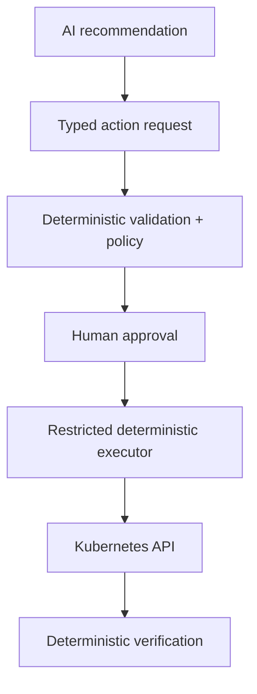

# v0.4 Controlled Actions

## Goal
Permit narrow remediation actions while keeping AI reasoning and privileged execution separated. AI may recommend an action; deterministic, policy-controlled code performs it.

## Entry requirements
- v0.3 read-only agent Definition of Done satisfied.
- Agent recommendations are sufficiently understandable and evidence-backed for demo scenarios.

## First-principles architecture



The LLM does not generate arbitrary privileged shell commands. It selects or proposes from a small, explicit operational vocabulary that normal code validates and executes.

## Required capabilities
- Separate executor service/workload from the incident agent.
- Separate Kubernetes service account for executor.
- Narrow executor RBAC limited to demo namespace and allowlisted resources/actions.
- Explicit typed action-request schema containing target, desired action, reason, evidence, risk and expiry.
- Deterministic schema validation and policy enforcement outside the LLM.
- Human approval mandatory for all write actions in v0.4.
- Approval/rejection state stored durably enough for audit/demo purposes.
- Action expiry to prevent stale approvals.
- Idempotency protection.
- Deterministic verification after execution.
- Agent cannot call Kubernetes write APIs directly.

## Initial allowlisted actions
Keep the first write surface intentionally small and implemented as normal code:

```text
restart_deployment(name)
scale_deployment(name, replicas)
```

These operations must enforce configured resource and namespace bounds. Additional actions require their own risk assessment before being added.

## Required controls
- Namespace restriction.
- Resource-name or label restriction where practical.
- Replica minimum/maximum bounds.
- Approval actor captured.
- Action request ID propagated through logs/traces.
- Reject unknown actions by default.
- Reject arbitrary shell/kubectl strings generated by the model.

## Definition of Done
- [ ] Agent identity remains read-only.
- [ ] Executor identity has only the agreed write permissions.
- [ ] AI output is converted into a typed action request, not arbitrary privileged commands.
- [ ] Deterministic validation/policy runs before approval/execution.
- [ ] Unapproved write request cannot execute.
- [ ] Expired request cannot execute.
- [ ] Unknown/non-allowlisted action is rejected.
- [ ] Approved restart/scale action executes successfully in the demo namespace.
- [ ] System verifies post-action state deterministically.
- [ ] Full path is auditable: recommendation → request → validation → approval/rejection → execution → verification.
- [ ] Demo proves the agent cannot bypass the control plane.

## Out of scope
- Fully autonomous writes.
- Broad cluster administration.
- IAM administration by the agent.
- Namespace deletion or arbitrary command execution.
- LLM-generated shell commands as the execution interface.

## Portfolio evidence
Demo the same incident twice: first reject the recommendation and prove nothing changes; then approve an allowlisted action and show controlled deterministic execution plus verification.

The key architecture story is: **AI reasons about ambiguity; policy and normal software control privileged execution.**
