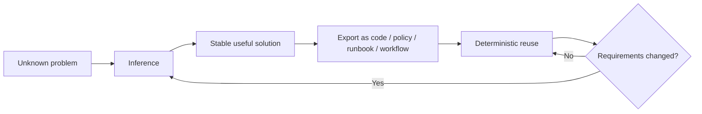

# v0.5 Production-ready Controls

## Goal
Harden the AgentOps reference architecture so identity, network/tool boundaries, failures, cost, inference usage and operator control are explicit and testable.

## Entry requirements
- v0.4 controlled action path works end to end.
- Audit trail links recommendation, validation, approval, execution and verification.
- v0.3 metrics distinguish deterministic and AI investigation paths.

## First-principles production rule

The production objective is not maximum autonomy or maximum LLM usage. It is the smallest justified inference surface that produces reliable operational value.

Ask continuously:

```text
Can normal code solve this reliably?
        ↓
If yes: keep it deterministic.
        ↓
If no: use bounded inference.
        ↓
If the inferred behavior becomes stable/repeated:
export it into code, policy, runbook or workflow when practical.
```

## Required capabilities

### Workload identity
- Use EKS Pod Identity for workloads that need AWS API access where supported by the chosen node/runtime model.
- Dedicated IAM role per workload permission set.
- No embedded AWS access keys.
- AWS SDKs use the default credential chain compatible with Pod Identity.

### Kubernetes authorization
- Review all service accounts and RBAC for least privilege.
- Agent remains read-oriented.
- Executor writes remain namespace/resource/action constrained.
- No `cluster-admin` for application/agent/executor workloads.

### Network boundaries
- NetworkPolicies for application, agent, executor and observability paths.
- Deny unnecessary east-west traffic.
- Egress requirements documented for model/AWS/tool endpoints.

### Secrets
- No secrets in Git, container images or plain Helm values committed to the repository.
- Use a documented secret-management path appropriate to AWS/Kubernetes.
- Rotate/revoke path documented.

### Tool policy
- Explicit allowlist.
- Unknown actions denied by default.
- Risk classification for tool actions.
- Resource/action bounds enforced outside the LLM.
- Arbitrary generated shell/kubectl strings are not accepted as privileged actions.

### Operational kill switch
- Operator can prevent new write actions quickly.
- Kill switch state is observable/auditable.
- Read-only diagnosis behavior after kill switch is explicitly defined.

### Reliability bounds
- Model timeout.
- Tool timeout.
- Maximum tool calls/reasoning steps.
- Retry limits/backoff.
- Circuit breaking or safe failure for unavailable dependencies where appropriate.
- Duplicate action protection.

### Inference and cost bounds
Measure and bound the cost of intelligence rather than treating model usage as free infrastructure.

Required measurements should include enough data to derive:

```text
incidents_total
deterministic_diagnoses_total
ai_investigations_total
ai_escalation_rate
ai_bypass_rate
tokens_per_investigation
estimated_cost_per_investigation
latency_per_path
tool_calls_per_investigation
low_confidence_rate
```

Required controls:
- Token/request usage measured.
- Per-run or per-incident budget/limits defined.
- Expensive/unbounded loops terminated.
- Model choice/config can be changed without rewriting agent business logic.
- Deterministic paths do not accidentally invoke the LLM.
- At least one review identifies whether a repeated inference path could be converted into normal code, policy, runbook or workflow.

### Infer-once / export review

For repeated operational behavior, evaluate this lifecycle:



This is not a requirement to eliminate all tokens. It is a requirement to justify repeated inference when deterministic execution would be cheaper, faster and more predictable.

### Auditability / observability
Capture enough context to answer:
- Which identity initiated the workflow?
- Which path was used: deterministic or AI?
- Why was inference invoked?
- Which model/version/config was used?
- How many tokens/tool calls did the investigation consume?
- Which tools were requested/called?
- What evidence informed the recommendation?
- Who approved/rejected a write?
- What changed in Kubernetes?
- Did verification succeed?

### Supply-chain baseline
- Dependency scanning in CI.
- Container/image vulnerability scanning.
- Pinned/reviewed action dependencies where practical.
- Build artifact traceability to source commit.

## Required failure scenarios
Demonstrate bounded behavior for at least:

1. Kubernetes permission denied.
2. Tool timeout/unavailable service.
3. Malformed tool response.
4. Model/provider timeout.
5. Repeated/reasoning-loop attempt exceeding configured bound.
6. Rejected or expired approval.
7. Kill switch enabled during an active operational period.
8. Deterministic path proving no LLM call is made for a known scenario.
9. AI path exceeding its configured token/cost or step budget and stopping safely.

Optional advanced scenarios:
- prompt injection contained in logs/tool output,
- secret-access attempt,
- network policy denial,
- compromised/unhealthy dependency.

## Reference architecture profile
By v0.5 document the difference between:
- **lab/cost-aware profile** used for portfolio demos, and
- **production reference profile** with stronger availability/networking choices.

The repo does not need to run an expensive HA production topology continuously, but the tradeoffs must be explicit.

## Definition of Done
- [ ] Workloads that need AWS APIs use workload identity rather than embedded credentials.
- [ ] IAM/RBAC permissions are documented and least-privilege reviewed.
- [ ] NetworkPolicies enforce intended boundaries.
- [ ] Secrets-management approach is implemented/documented.
- [ ] Tool policy denies non-allowlisted actions and arbitrary privileged shell commands.
- [ ] Kill switch stops new write actions.
- [ ] Timeout/retry/reasoning/tool-call bounds are enforced.
- [ ] Deterministic and AI paths are separately measurable.
- [ ] At least one known scenario bypasses inference by design.
- [ ] Token/cost usage is measurable and bounded.
- [ ] A repeated AI path has been reviewed as a candidate for deterministic export.
- [ ] Audit trail answers the core identity/path/model/tool/approval/change questions.
- [ ] CI includes dependency/image security checks.
- [ ] Required failure scenarios have automated or repeatable tests.
- [ ] Recovery/rollback procedure is documented.
- [ ] Lab vs production-reference tradeoffs are documented.

## Portfolio / consulting evidence
The final demo should show not only a successful AI-assisted remediation, but also:

- a known incident handled without inference,
- an ambiguous incident where AI adds measurable value,
- the cost/latency difference between both paths,
- what happens when permission is denied,
- what happens when a budget is exceeded,
- what happens when an approval is rejected,
- what happens when an operator activates the kill switch.

That distinction is the core project message:

> **Running agents reliably and safely in production is a platform engineering problem, and good platform engineering includes knowing when not to use an LLM.**
