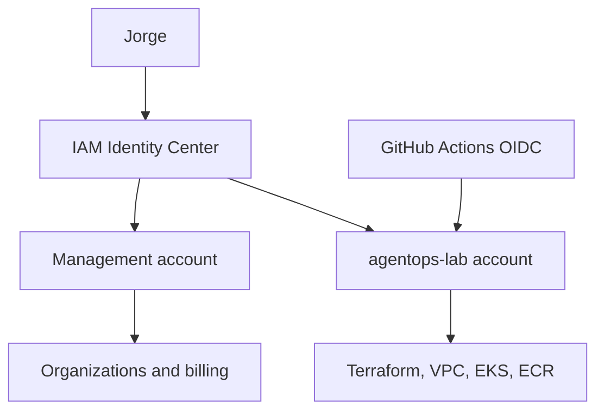

# AWS Account, Identity, and Cost Bootstrap Design

**Date:** 2026-08-24  
**Status:** Approved design; implementation pending user review  
**Project:** `Wlanez/agentops-eks`  
**Primary region:** `us-west-2`

## Purpose

Create a safe AWS foundation for the `agentops-eks` learning and portfolio environment before provisioning Terraform state, networking, Amazon EKS, Amazon ECR, or application workloads.

The design must:

- use temporary credentials for human access;
- avoid long-lived AWS access keys;
- isolate lab workloads from the AWS Organizations management account;
- make lab costs visible early;
- keep the management account free of project workloads;
- prepare for GitHub Actions OIDC in a later v0.1 workstream;
- remain small enough for a two-account personal learning environment.

## Current starting state

- The existing AWS account is standalone and currently empty.
- Root MFA is enabled.
- The root user has no access keys.
- A distinct business email address controlled by the owner is available for the member account.
- The selected AWS region is `us-west-2`.
- The approved monthly lab budget is USD 30.

## Considered approaches

### 1. Single standalone account

Fastest to begin, but provides weaker workload isolation and does not establish the multi-account access pattern used by mature AWS environments.

### 2. AWS Organization with workloads in the management account

Enables IAM Identity Center, but AWS recommends keeping workloads outside the management account. Service control policies also do not restrict principals in the management account.

### 3. AWS Organization with a dedicated member account

**Selected.** The existing account becomes the management account and a new member account named `agentops-lab` contains all project workloads.

This adds a small amount of initial setup while providing a hard account boundary, consolidated billing, temporary human credentials, and a credible multi-account portfolio story.

## Target account topology

## Management account responsibilities

The management account contains only:

- AWS Organizations;
- IAM Identity Center;
- consolidated billing, AWS Budgets, and Cost Anomaly Detection;
- account creation and organization administration;
- exceptional organization-level administration.

The following are explicitly excluded:

- EKS clusters;
- project VPCs and NAT gateways;
- ECR repositories for the project;
- application workloads;
- Terraform-managed AgentOps resources;
- GitHub Actions deployment roles for the application platform.

## Member account responsibilities

The `agentops-lab` member account contains:

- Terraform remote-state prerequisites;
- project IAM roles and policies;
- VPC, subnets, routes, endpoints, and NAT resources;
- Amazon EKS and managed node groups;
- Amazon ECR;
- Helm-deployed services;
- observability, incident scenarios, and later AI-agent components;
- the future GitHub Actions OIDC provider and restricted CI/CD roles.

The member account uses `us-west-2` as the default project region. Region remains an explicit Terraform input rather than a hard-coded architectural dependency.

## Human identity design

IAM Identity Center provides the human identity and temporary AWS credentials.

### Identity

- User: `jorge.nunez`
- MFA: required
- Authentication: IAM Identity Center portal and AWS CLI SSO
- Long-lived IAM access keys: prohibited

### Management account access

- Group: `OrganizationAdministrators`
- Permission set: `OrganizationAdmin`
- Initial managed policy: `AdministratorAccess`
- Session duration: 1 hour
- Purpose: Organizations, IAM Identity Center, billing, budgets, and member-account administration

This permission set is not used for EKS, Terraform, or normal project work.

### Member account access

Two permission sets are created initially:

1. `AgentOpsBootstrapAdmin`
   - Initial managed policy: `AdministratorAccess`
   - Session duration: 1 hour
   - Purpose: create the initial IAM, Terraform state, networking, EKS, ECR, and CI/CD foundations.

2. `AgentOpsReadOnly`
   - Managed policy: `ReadOnlyAccess`
   - Purpose: safe inspection, learning, inventory, and diagnosis.

After the Terraform and IAM bootstrap is stable, the project will introduce an `AgentOpsPlatformEngineer` permission set with narrower permissions. `AgentOpsBootstrapAdmin` will then be reserved for exceptional bootstrap-level changes.

## Machine identity separation

Human and machine identities remain distinct.

GitHub Actions will not reuse Jorge's SSO identity. A later v0.1 workstream creates a dedicated `agentops-github-role` in `agentops-lab` with:

- GitHub OIDC federation;
- trust restricted to `Wlanez/agentops-eks`;
- branch or GitHub Environment restrictions;
- explicit workflow permissions;
- no stored AWS access key ID or secret access key;
- permissions separated between validation, artifact publication, and deployment where justified.

No GitHub OIDC or CI/CD role is required during the account bootstrap itself.

## Cost controls

### Monthly budget

Create a consolidated monthly cost budget of **USD 30** with:

- actual-cost notification at USD 10;
- actual-cost notification at USD 20;
- actual-cost and forecasted-cost notifications at USD 30;
- notifications sent to the approved private business email.

### Anomaly detection

Enable Cost Explorer and confirm Cost Anomaly Detection coverage for the organization. Configure notification for an anomaly impact of USD 5 or greater.

### Operational cost controls

A budget is an alert, not a real-time spending cap. The implementation therefore also requires:

- an estimated-cost review before each `terraform apply`;
- a documented `terraform destroy` procedure;
- an explicit end-of-session inventory check;
- no unattended EKS cluster, managed nodes, load balancer, or NAT gateway;
- immutable tagging of project and environment resources;
- documentation identifying EKS, EC2 nodes, NAT, load balancers, and telemetry backends as continuous cost drivers.

The lab targets short-lived provision, verification, evidence capture, and teardown sessions.

## Bootstrap sequence

1. Sign in with the secured root identity.
2. Create an AWS Organization with all features enabled.
3. Enable the organization instance of IAM Identity Center in `us-west-2`.
4. Create `jorge.nunez`, require MFA, and create `OrganizationAdministrators`.
5. Create and assign `OrganizationAdmin` to the management account.
6. Sign out of root.
7. Prove console access through IAM Identity Center.
8. Create the member account named `agentops-lab` using the approved private business email.
9. Create `AgentOpsBootstrapAdmin` and `AgentOpsReadOnly`.
10. Assign both member-account permission sets to `jorge.nunez`.
11. Configure AWS CLI SSO profiles for management and lab access.
12. Verify both identities with `aws sts get-caller-identity`.
13. Configure the USD 30 budget and anomaly detection in the management account.
14. Confirm that no workload resources exist in the management account.
15. Record non-sensitive evidence of the completed bootstrap.
16. Begin the Terraform remote-state design and implementation.

Root is not used after step 6 unless AWS requires a root-only operation.

## Verification evidence

The bootstrap is complete only when all of the following are true:

- AWS Organizations shows the management and `agentops-lab` accounts.
- IAM Identity Center is active in `us-west-2`.
- Root remains protected by MFA and has no access keys.
- `jorge.nunez` can access both assigned accounts through the portal.
- AWS CLI SSO succeeds without long-lived access keys.
- `aws sts get-caller-identity` returns the expected account for both profiles.
- `AgentOpsReadOnly` cannot mutate resources.
- Budget notifications are configured at USD 10, USD 20, and USD 30.
- A cost-anomaly monitor and alert subscription exist.
- The management account contains no AgentOps workloads.
- No secrets, account emails, account IDs, portal URLs, or credentials are committed to Git.

## Intentionally out of scope

The bootstrap does not include:

- AWS Control Tower;
- custom service control policies;
- delegated security or logging accounts;
- IAM Identity Center configuration as code;
- production-grade break-glass workflows;
- Terraform project resources;
- EKS, ECR, VPC, or application resources;
- GitHub Actions OIDC.

These can be added only when they solve a demonstrated requirement.

## Risks and mitigations

| Risk | Mitigation |
|---|---|
| Administrator permission used for normal work | Create read-only access immediately and replace routine admin use with `AgentOpsPlatformEngineer` after bootstrap |
| Resources accidentally created in management | Separate CLI profiles, verify STS identity, and use Terraform `allowed_account_ids` |
| Unexpected EKS/NAT costs | USD 30 budget, USD 5 anomaly alert, short-lived lab sessions, inventory check, and mandatory teardown |
| Credentials committed to Git | Use Identity Center and OIDC only; prohibit static access keys and secrets in repository files |
| Wrong region selected | Use `us-west-2` as the home/default region and keep workload region configurable |
| Premature governance complexity | Defer Control Tower, custom SCPs, and extra security accounts |

## Next implementation boundary

After this design is reviewed, the implementation plan will cover only the account and identity bootstrap. Terraform remote state remains the next separate implementation block and begins only after account bootstrap verification succeeds.
