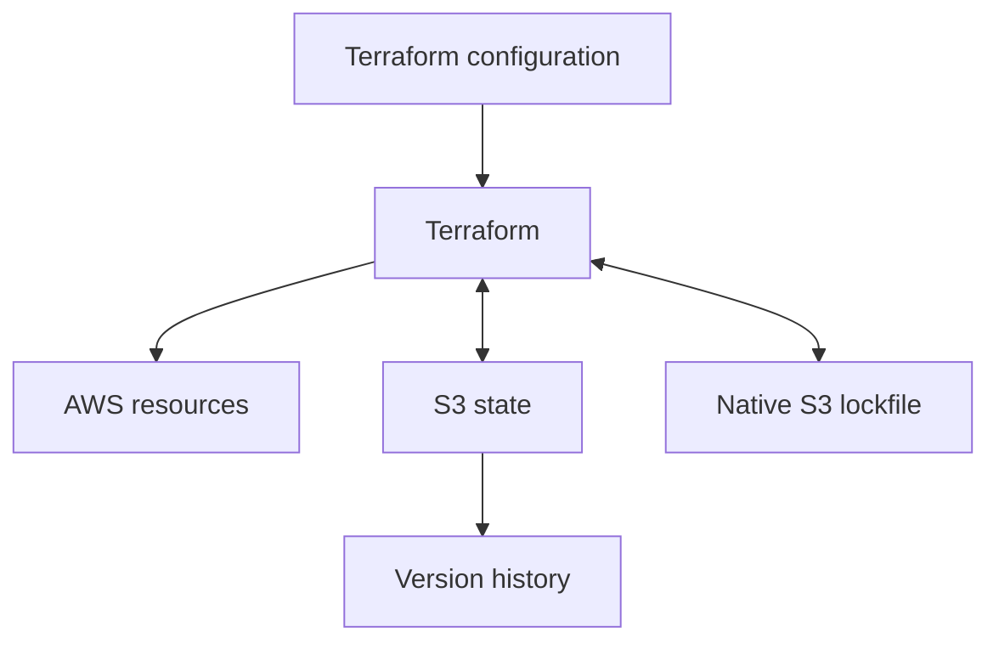
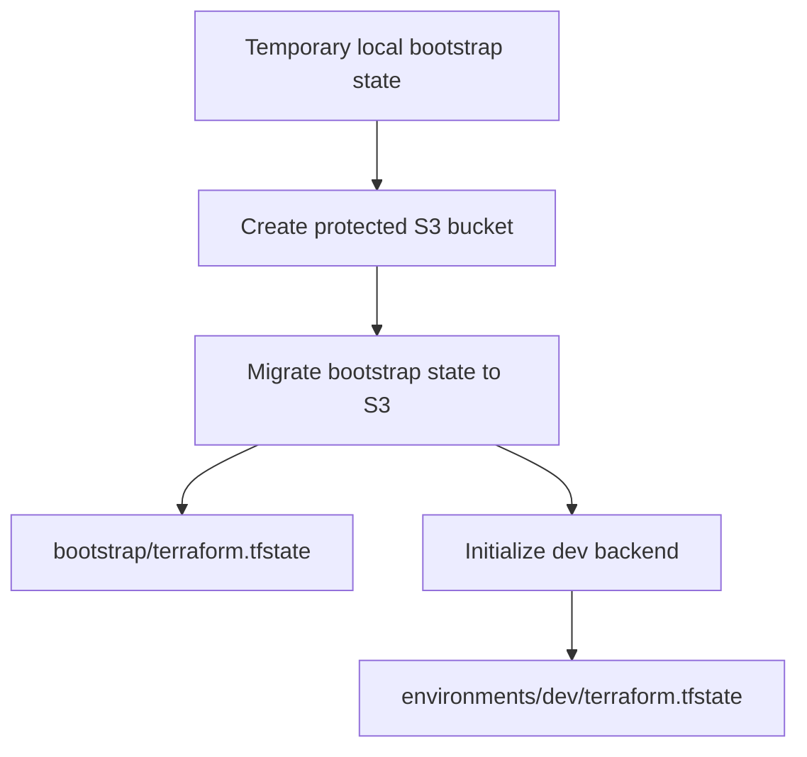
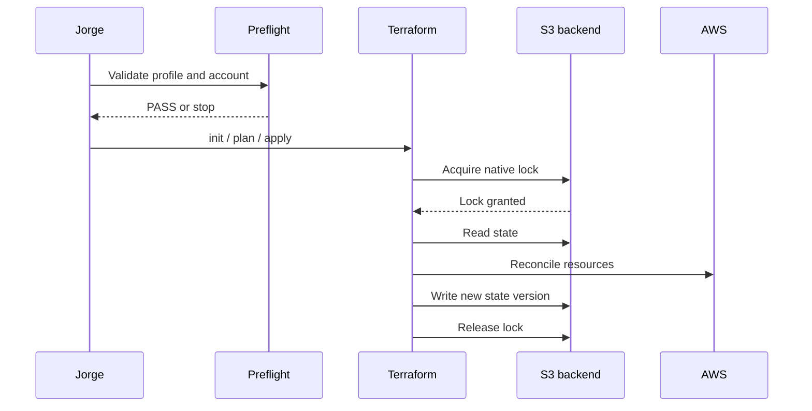

# Terraform State Bootstrap Design

**Status:** Approved design, pending implementation  
**Date:** 2026-08-25  
**Milestone:** v0.1 Foundation

## Goal

Create the smallest safe Terraform backend foundation for `agentops-eks`: one protected Amazon S3 bucket in the `agentops-lab` member account, native S3 state locking, a separate bootstrap lifecycle, and a verified remote-state contract for the future `dev` environment.

The design must teach why Terraform state exists, make wrong-account execution difficult, avoid long-lived credentials, and produce sanitized public evidence without creating VPC, EKS, ECR, NAT gateway, load balancer, or application resources.

## Context

Terraform configuration describes desired infrastructure. Terraform state records the relationship between that configuration and the real resources Terraform already manages. State is operationally important data, not a disposable cache.

A local-only state file creates three problems:

1. another developer or CI runner does not have the same infrastructure inventory;
2. loss of the workstation can remove Terraform's management history;
3. simultaneous writers can produce conflicting updates.

The v0.1 foundation therefore needs remote state before workload infrastructure is built.

## First-principles model



- Configuration answers: **What should exist?**
- State answers: **What does this configuration already manage?**
- The lockfile answers: **Is another Terraform operation currently using this state?**
- S3 versioning answers: **Can an earlier state version be recovered after human error?**

## Decision

Use a dedicated S3 bucket in the `agentops-lab` member account.

The bucket belongs to a separate Terraform root module at `terraform/bootstrap`. Future environment infrastructure belongs to `terraform/environments/dev`. Destroying the future `dev` stack must not include the state bucket in its dependency graph.

### Why the state bucket stays in `agentops-lab`

A dedicated administrative or shared-services account provides stronger isolation in larger organizations. This project currently has only a management account and one disposable lab member account.

The management-account boundary already limits that account to organization, identity, and consolidated billing administration. Adding Terraform state there would:

- weaken the established management-account workload boundary;
- require cross-account backend permissions immediately;
- add policy complexity before the project has CI or multiple environments;
- make the learning path harder without materially improving this lab.

A future production variant may introduce a dedicated shared-services account. It is not part of v0.1.

## Alternatives considered

| Alternative | Decision | Reason |
|---|---|---|
| S3 in `agentops-lab` | Selected | AWS-native, low cost, compatible with the existing two-account boundary |
| S3 in the management account | Rejected for v0.1 | Violates the current management-account boundary and requires cross-account access |
| HCP Terraform | Rejected for v0.1 | Adds an external control plane and removes part of the AWS backend learning objective |
| S3 plus DynamoDB locking | Rejected | DynamoDB-based S3 backend locking is deprecated |
| Console-created bucket | Rejected | The project requires infrastructure ownership through code |

## The bootstrap problem

The S3 bucket must exist before Terraform can use it as a backend. This creates a controlled two-stage lifecycle:



### Stage 1: Create the backend infrastructure

The bootstrap root module initially runs with local state. The first bootstrap commit does not contain `terraform/bootstrap/backend.tf`; therefore the initial `terraform init` uses Terraform's local backend instead of trying to contact a bucket that does not exist.

It creates only:

- the S3 bucket;
- versioning;
- default server-side encryption;
- S3 Block Public Access;
- Bucket Owner Enforced object ownership;
- a TLS-only bucket policy.

Local bootstrap state is never committed.

### Stage 2: Migrate the bootstrap state

After AWS readback verifies every bucket control, add `terraform/bootstrap/backend.tf` in a separate reviewed commit. The bootstrap configuration then enables the partial S3 backend and runs `terraform init -migrate-state`.

The bootstrap state then moves to:

```text
bootstrap/terraform.tfstate
```

The future development environment uses a different key:

```text
environments/dev/terraform.tfstate
```

Storing the bootstrap stack's state in the bucket it manages creates a deliberate self-reference. Destruction therefore requires a special documented teardown procedure; normal environment teardown never touches this stack.

## Account and identity boundary

All bootstrap and backend commands run with:

```text
AWS_PROFILE=agentops-lab-bootstrap
AWS_REGION=us-west-2
AWS_DEFAULT_REGION=us-west-2
```

No profile name, credentials, account ID, ARN, email, SSO portal URL, or token is written into Terraform source or committed configuration.

A preflight script must verify without printing private identifiers:

1. `agentops-lab-bootstrap` authenticates successfully;
2. its role ARN contains `AgentOpsBootstrapAdmin`;
3. its account differs from the account used by `agentops-org-admin`;
4. the selected region is `us-west-2`;
5. no static access-key environment variables are present.

The script exits non-zero before Terraform runs when any check fails.

The bootstrap role is temporarily administrative because this is the approved foundation stage. A later GitHub OIDC workstream creates narrower automation roles. The bootstrap does not create an IAM user or access key.

## Bucket naming

Use the AWS provider's generated-name capability:

```text
bucket_prefix = "agentops-eks-tfstate-"
```

The final globally unique bucket name includes a provider-generated suffix.

This deliberately improves on embedding the AWS account ID in the globally visible bucket name:

- no private account identifier is encoded in the name;
- no random provider is required;
- name collisions are avoided;
- the real name remains available as a sensitive Terraform output.

Commands may resolve the name into a shell variable. Documentation and evidence must never print the actual value.

A resolver must stop unless exactly one bucket owned by the active account matches the prefix. It must never silently choose the first of multiple matches.

## State paths

Do not use Terraform workspaces in v0.1. Explicit root directories and S3 keys make lifecycle boundaries easier to understand.

| Root module | Backend key | Responsibility |
|---|---|---|
| `terraform/bootstrap` | `bootstrap/terraform.tfstate` | State bucket and its protections |
| `terraform/environments/dev` | `environments/dev/terraform.tfstate` | Future VPC, EKS, ECR, and application foundation |

The native lock object uses the same key plus `.tflock`.

## S3 security controls

| Control | Required configuration | Purpose |
|---|---|---|
| Region | `us-west-2` | Matches the approved project region |
| Versioning | `Enabled` | Allows recovery from accidental state overwrite or deletion |
| Default encryption | SSE-S3 / AES256 | Encrypts state at rest without a paid customer-managed KMS key |
| Backend encryption | `encrypt = true` | Makes the backend's encryption intent explicit |
| Public access | All four block settings enabled | Prevents public ACL or policy exposure |
| Object ownership | `BucketOwnerEnforced` | Disables ACLs and uses policy-based authorization |
| Transport | Explicit deny when `aws:SecureTransport=false` | Rejects non-TLS access |
| Destructive behavior | `force_destroy = false` | Prevents deleting a non-empty state bucket |
| Lifecycle guard | `prevent_destroy = true` on critical resources | Makes an ordinary destroy fail during planning |
| Tags | Project, Environment, ManagedBy, Purpose | Supports inventory, ownership, and cost review |

SSE-S3 is selected instead of a customer-managed KMS key because the bucket remains in one account, the state volume is small, and v0.1 prioritizes a low-cost reproducible lab. A production variant can introduce a KMS key with a dedicated key policy.

No automatic noncurrent-version deletion is configured in this workstream. State versions are small, and recovery value is more important than negligible storage savings during v0.1.

## Native state locking

Every S3 backend block sets:

```hcl
use_lockfile = true
```

DynamoDB is not created.

The principal operating Terraform needs:

- `s3:ListBucket` for the relevant prefix;
- `s3:GetObject` and `s3:PutObject` for the state object;
- `s3:GetObject`, `s3:PutObject`, and `s3:DeleteObject` for the `.tflock` object.

Terraform does not require `s3:DeleteObject` for the state object itself.

The current human bootstrap role already has broader temporary administration. The future CI role must receive path-scoped permissions rather than bucket-wide administrator access.

## Partial backend configuration

Backend source files contain only stable, public-safe values:

```hcl
terraform {
  backend "s3" {
    key          = "environments/dev/terraform.tfstate"
    region       = "us-west-2"
    encrypt      = true
    use_lockfile = true
  }
}
```

The real bucket name is passed during `terraform init`:

```text
-backend-config="bucket=<resolved locally>"
```

Credentials are never passed through `-backend-config`. Terraform obtains temporary credentials from the active AWS SSO profile.

The `.terraform/` directory is ignored because Terraform caches the completed backend configuration there.

## Repository structure

```text
.gitignore
scripts/
└── aws-terraform-preflight.sh

terraform/
├── README.md
├── bootstrap/
│   ├── README.md
│   ├── backend.tf
│   ├── versions.tf
│   ├── providers.tf
│   ├── variables.tf
│   ├── main.tf
│   └── outputs.tf
└── environments/
    └── dev/
        ├── README.md
        ├── backend.tf
        ├── versions.tf
        ├── main.tf
        └── outputs.tf

docs/
├── superpowers/
│   ├── specs/2026-08-25-terraform-state-bootstrap-design.md
│   └── plans/2026-08-25-terraform-state-bootstrap.md
└── evidence/v0.1/terraform-state-bootstrap.md
```

### File responsibilities

| File | Responsibility |
|---|---|
| `.gitignore` | Exclude state, plans, backend caches, crash logs, variable secrets, and local override files |
| `scripts/aws-terraform-preflight.sh` | Validate SSO profile, role, account separation, region, and absence of static credentials |
| `terraform/README.md` | Explain root modules, state boundaries, safe command order, and global troubleshooting |
| `bootstrap/versions.tf` | Set Terraform and provider version constraints |
| `bootstrap/providers.tf` | Configure AWS region and default tags without credentials |
| `bootstrap/variables.tf` | Define validated region, project, and tag inputs |
| `bootstrap/main.tf` | Create the bucket and all security controls |
| `bootstrap/outputs.tf` | Expose the real bucket name as a sensitive output for local command composition |
| `bootstrap/backend.tf` | Define the partial S3 backend; create this file only after the bucket passes AWS readback |
| `bootstrap/README.md` | Explain the two-stage local-to-remote migration and deliberate teardown |
| `dev/backend.tf` | Define the separate remote state key and native S3 lockfile |
| `dev/versions.tf` | Require a Terraform version that supports native S3 lockfiles |
| `dev/main.tf` | Store a cost-free `terraform_data` backend contract before AWS workloads exist |
| `dev/outputs.tf` | Provide a non-sensitive backend-contract result |
| `dev/README.md` | Explain initialization, validation, state verification, and stop conditions |
| Evidence document | Record only sanitized PASS/FAIL outcomes |

## Tool and provider versions

- Terraform requirement: `>= 1.10.0, < 2.0.0`.
- Current implementation target: Terraform 1.15.x.
- AWS provider constraint for bootstrap: `~> 6.61.0`.
- Commit the generated `.terraform.lock.hcl` for each root module that uses external providers.

Terraform 1.10 is the minimum because the design depends on native S3 lockfiles. The implementation plan begins by reading the installed version and stops with upgrade instructions when the requirement is not met.

The version constraint protects compatibility. The provider lock file records the selected package and checksums so later initialization does not silently select an unrelated provider build.

The `.terraform.lock.hcl` dependency lock file is different from the temporary S3 `.tflock` state lock:

| File | Purpose | Committed? |
|---|---|---|
| `.terraform.lock.hcl` | Provider version and checksum selection | Yes |
| `terraform.tfstate.tflock` | Prevent concurrent state writers | No; temporary object in S3 |
| `terraform.tfstate` | Infrastructure state | No; stored in S3 |

## Backend verification contract

The `dev` root includes a built-in `terraform_data` resource containing only:

- project: `agentops-eks`;
- environment: `dev`;
- backend type: `s3`;
- locking type: `native-s3-lockfile`.

The built-in resource creates no AWS infrastructure and has no cloud cost. Its purpose is to guarantee that `terraform apply` writes a real remote state object before VPC/EKS implementation starts.

Successful verification requires:

1. remote backend initialization succeeds;
2. the contract apply reports exactly one `terraform_data` resource and no AWS resource;
3. `terraform state pull` succeeds;
4. the state contains the contract resource;
5. S3 `head-object` confirms the state key exists without printing the object;
6. the backend configuration contains `use_lockfile = true`;
7. no DynamoDB resource or backend argument exists.

Do not publish raw state. State can contain sensitive values in future workstreams even when outputs are marked sensitive.

## Normal operating flow



Every mutating operation follows:

1. authenticate through SSO;
2. run preflight;
3. run formatting and validation;
4. initialize or reconfigure the backend only when required;
5. create and save a plan;
6. review the plan;
7. apply the reviewed plan;
8. read back AWS controls;
9. capture sanitized results;
10. log out when the session is no longer needed.

No implementation script automatically approves an apply.

## Error handling and stop conditions

Stop without applying when any of these occurs:

- the active role is not `AgentOpsBootstrapAdmin`;
- the active account equals the management account;
- AWS authentication fails or requests access keys;
- Terraform is older than 1.10;
- the plan contains a resource outside the approved S3 bootstrap controls;
- an existing bucket with the project prefix cannot be attributed safely;
- multiple project-prefix buckets exist;
- backend initialization proposes copying an unexpected state;
- versioning, encryption, ownership, public-access blocking, or TLS policy readback fails;
- `terraform state pull` fails;
- Git detects a state, plan, credential, account identifier, or real bucket name.

Do not fix an unexpected-account error by editing an account ID into source. Correct the SSO profile or local environment.

Do not use `-lock=false` to bypass a lock. Investigate the current operation first. Use `terraform force-unlock` only after confirming the original writer is gone and recording the lock identifier privately.

## Recovery model

### Accidental state overwrite or deletion

1. Stop all Terraform writers.
2. Inspect S3 object versions without publishing names or contents.
3. Identify the last known-good version.
4. Download a private backup.
5. Restore deliberately.
6. run `terraform plan -refresh-only`;
7. review all proposed differences before any normal apply.

### Lost local `.terraform/` directory

This is expected to be recoverable:

1. authenticate through SSO;
2. run preflight;
3. resolve exactly one state bucket by prefix;
4. run `terraform init -reconfigure` with the resolved bucket;
5. run `terraform state pull` without publishing its content.

### Lost bootstrap checkout or local cache

The S3 state remains authoritative. A fresh clone resolves the bucket, initializes the bootstrap backend, and pulls the remote state.

### Stale lock

Wait for or terminate the known Terraform process first. Do not delete the `.tflock` object manually. Use Terraform's unlock workflow only after proving no writer remains.

## Deliberate teardown

Normal `terraform destroy` applies only to `terraform/environments/dev`. It must leave the bootstrap bucket intact.

Destroying the bootstrap is a separate, destructive recovery procedure:

1. destroy and verify every environment state managed from the bucket;
2. disable all writers and CI;
3. pull and store private state backups;
4. migrate bootstrap state back to a local backend;
5. verify the local state can be read;
6. explicitly remove the `prevent_destroy` guards in a reviewed change;
7. delete all object versions and delete markers using an exact resolved bucket name;
8. destroy the bootstrap resources;
9. verify the bucket no longer exists;
10. remove private local state only after the teardown evidence is complete.

The implementation plan must request explicit human confirmation before steps that remove versions, state, or the bucket.

## Cost model

This workstream creates only one small S3 bucket. Expected cost is limited to small storage and request charges. It creates no:

- EKS cluster;
- EC2 node;
- NAT gateway;
- load balancer;
- KMS customer-managed key;
- DynamoDB table.

The bucket remains after routine `dev` teardown because it is a protected administrative prerequisite.

## Evidence and privacy

Create `docs/evidence/v0.1/terraform-state-bootstrap.md` only after execution succeeds.

Evidence may record:

- completion date;
- region;
- preflight PASS;
- formatting and validation PASS;
- bootstrap plan resource count;
- versioning/encryption/public-access/ownership/TLS checks PASS;
- backend initialization PASS;
- remote state pull PASS;
- native lockfile configuration PASS;
- DynamoDB absence PASS;
- repository privacy scan PASS.

Evidence must exclude:

- AWS account IDs;
- bucket names or ARNs;
- state contents;
- SSO portal URLs;
- emails;
- role ARNs;
- tokens;
- credentials;
- local paths containing personal information.

## Verification strategy

### Static checks

- shell syntax validation for the preflight script;
- `terraform fmt -check -recursive terraform`;
- `terraform init -backend=false` where appropriate;
- `terraform validate`;
- scan for forbidden state/backend artifacts;
- scan for account IDs, bucket names, emails, URLs, and credential patterns.

### Plan review

The bootstrap plan must contain only the approved S3 resources and data sources. Save the binary plan outside Git tracking and inspect its machine-readable form for resource types.

No `apply` occurs from an unreviewed or newly regenerated plan.

### AWS readback

Use AWS CLI read operations to confirm:

- bucket region;
- versioning enabled;
- default encryption AES256;
- all four public-access blocks enabled;
- Bucket Owner Enforced;
- TLS-only bucket policy present;
- expected project tags present.

Commands compare values and print only named PASS/FAIL results.

### Remote backend readback

- initialize both keys with the same resolved bucket;
- apply the cost-free backend contract;
- pull state without displaying it;
- verify the expected state key exists;
- verify the backend source contains `use_lockfile = true`;
- verify the repository contains no DynamoDB locking configuration.

## Acceptance criteria

The design is implemented only when all are true:

- [ ] Preflight proves use of the lab bootstrap role and rejects the management account.
- [ ] Terraform and provider versions satisfy the documented constraints.
- [ ] Bootstrap configuration creates only the approved state bucket controls.
- [ ] The bucket is in `agentops-lab` and `us-west-2`.
- [ ] Versioning is enabled.
- [ ] SSE-S3 default encryption is explicit.
- [ ] All four public-access blocks are enabled.
- [ ] ACLs are disabled with Bucket Owner Enforced.
- [ ] Non-TLS access is denied.
- [ ] `force_destroy=false` and lifecycle destroy guards are active.
- [ ] Bootstrap state is migrated from temporary local state to S3.
- [ ] Bootstrap and dev use separate state keys.
- [ ] Both backends use native S3 lockfiles.
- [ ] No DynamoDB table is created.
- [ ] The cost-free backend contract is stored in remote state.
- [ ] `terraform state pull` succeeds without exposing its contents.
- [ ] No state, plan, backend cache, private identifier, real bucket name, or credential is committed.
- [ ] Sanitized evidence is committed.
- [ ] Routine dev teardown leaves the state bucket intact.
- [ ] Destructive bootstrap teardown requires a separate explicit approval.

## Out of scope

- VPC, subnets, NAT gateway, EKS, ECR, and application infrastructure;
- GitHub OIDC provider and CI IAM roles;
- cross-account Terraform administration;
- customer-managed KMS key;
- HCP Terraform;
- Terraform workspaces;
- DynamoDB locking;
- automated deletion of state history;
- organization-wide S3 policies.

## References

- HashiCorp S3 backend: https://developer.hashicorp.com/terraform/language/backend/s3
- HashiCorp `terraform_data`: https://developer.hashicorp.com/terraform/language/resources/terraform-data
- HashiCorp `terraform state pull`: https://developer.hashicorp.com/terraform/cli/commands/state/pull
- Amazon S3 Block Public Access: https://docs.aws.amazon.com/AmazonS3/latest/userguide/access-control-block-public-access.html
- Amazon S3 Object Ownership: https://docs.aws.amazon.com/AmazonS3/latest/userguide/about-object-ownership.html
- Amazon S3 default encryption: https://docs.aws.amazon.com/AmazonS3/latest/userguide/bucket-encryption.html
