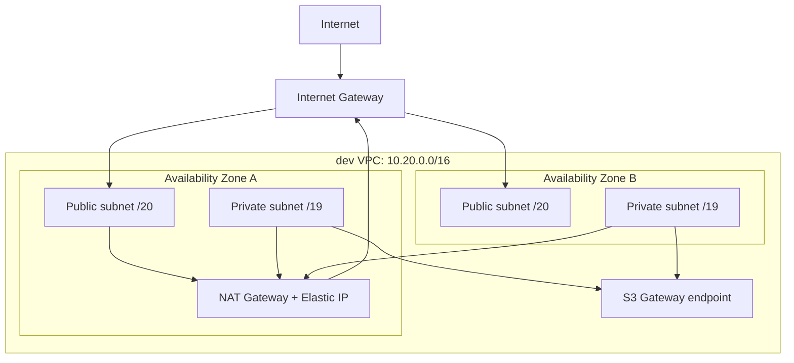

# Dev Network Design

**Status:** Approved design, pending implementation
**Date:** 2026-08-26
**Milestone:** v0.1 Foundation

## Goal

Create the smallest secure, reproducible network foundation for the `dev` environment before Amazon EKS is added. The network must place future EKS worker nodes in private subnets across two Availability Zones, support their outbound connectivity without inbound SSH, and make the lab's cost and availability tradeoff explicit.

## Scope

This workstream creates only the `dev` VPC network:

- VPC, Internet Gateway, public and private subnets, route tables and associations;
- one Elastic IP and one NAT Gateway;
- one S3 Gateway VPC endpoint associated with private route tables.

It does not create EKS, EC2 nodes, ECR, load balancers, an ingress controller, VPC Interface endpoints, VPN/bastion access, security groups, or application resources. The resulting Terraform graph contains exactly 19 managed AWS resources.

## Architecture

Future EKS worker nodes run in `PRIVA` and `PRIVB`. They have no public IP addresses. Their ordinary outbound traffic uses the NAT Gateway; S3 traffic can use the Gateway endpoint without NAT data processing or Interface endpoint hourly cost.

## Decisions

### Addressing and Availability Zones

The VPC CIDR is `10.20.0.0/16`. Terraform selects two available, opted-in Availability Zones dynamically in `us-west-2`; source never hard-codes zone letters or account-specific zone IDs.

Each selected AZ receives:

| Subnet type | Size | Purpose |
|---|---:|---|
| Public | `/20` | NAT placement and future public load balancers |
| Private | `/19` | Future EKS nodes and pod IP capacity |

The private subnets are deliberately larger because EKS VPC networking consumes addresses for nodes and pods. CIDRs are derived predictably from the VPC CIDR so the design can add AZs later without a redesign.

### Routing and NAT cost boundary

Public route tables send `0.0.0.0/0` to the Internet Gateway. Private route tables send `0.0.0.0/0` to the sole NAT Gateway in the first public subnet.

One NAT Gateway is an explicit v0.1 lab decision. It limits hourly and data-processing cost but is not highly available: an outage in the NAT's AZ prevents ordinary Internet egress from private subnets in either AZ. A production profile would create one NAT Gateway per AZ and route each private subnet to its local NAT.

### Endpoints

The network creates an S3 Gateway endpoint only. Gateway endpoints have no hourly charge and reduce unnecessary NAT traversal for S3 traffic.

ECR API, ECR DKR, STS and EC2 Interface endpoints are deferred. They add per-hour and per-AZ charges while the single NAT topology already supplies required egress. They can be introduced as a later privacy or resilience decision with path-specific endpoint policies.

### EKS readiness and access boundary

Subnets carry the EKS discovery tags needed for future internal and public load-balancer placement. No load balancer is created in this workstream.

There is no inbound SSH path because this workstream creates no compute, EKS endpoint, load balancer or Terraform-managed security group. Public subnets and an Internet Gateway do not independently expose a workload.

No Terraform-managed security group is created in this workstream. A security group created now would not protect anything because no resource would be associated with it.

The future EKS workstream will define and consume a required `admin_cidr_blocks` variable. It will enable private endpoint access for node-to-control-plane traffic and restrict the public endpoint to explicitly trusted operator CIDRs. A fully private operator-access model remains deferred until VPN, Direct Connect or a controlled in-VPC administration path exists.

## Terraform boundaries

All network resources belong to `terraform/environments/dev` and use its existing S3 backend key, `environments/dev/terraform.tfstate`. They are direct AWS resources rather than a community or local module: the network is one environment-specific topology and the project does not yet have repeated consumers that justify an abstraction.

The bootstrap root remains separate. Destroying `dev` must never include the state bucket or its state key.

## Inputs, validation and tags

Terraform exposes validated variables for AWS region, VPC CIDR, selected-AZ count, project and environment. The default selected-AZ count is two. This workstream does not request an administrative CIDR that it cannot enforce.

Every resource receives the existing project, environment and Terraform ownership tags, plus EKS subnet discovery tags where applicable.

## Verification

Before AWS apply, format, validate and test the module with a mocked provider. A saved plan is reviewed by an allowlist verifier that accepts only the approved network resource types and create actions.

After apply, sanitized AWS readback verifies the VPC CIDR, two AZs, subnet public/private route separation, the single NAT route, S3 endpoint associations and tags. The exact plan allowlist proves that this workstream creates no EKS, EC2, load balancer or Terraform-managed security-group resource. Verification output never prints account IDs, resource IDs, public IPs or private CIDR details beyond the approved design.

## Cost and destruction

The NAT Gateway is the persistent cost driver in this workstream. The VPC, route tables, Internet Gateway and S3 Gateway endpoint do not themselves add hourly charges. No EKS or compute cost is introduced.

The normal `dev` destroy path removes the network resources and never touches `terraform/bootstrap` or the remote state bucket. Destroying a NAT Gateway releases its associated Elastic IP as part of Terraform-managed teardown.
